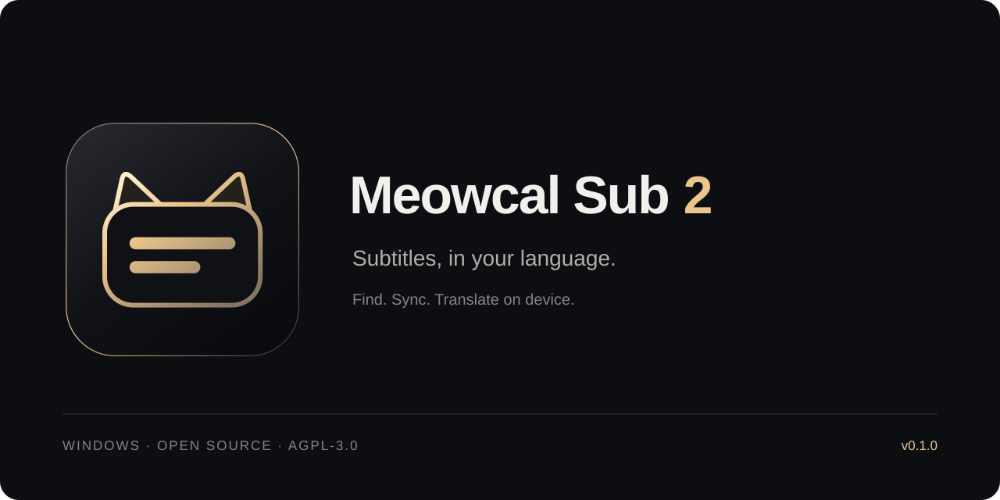

<p align="center">
  
</p>

<p align="center">
  <a href="https://github.com/PeterShanxin/Meowcal-Sub-2/releases/latest"></a>
  
  <a href="LICENSE"></a>
</p>

<p align="center">
  <a href="https://github.com/PeterShanxin/Meowcal-Sub-2/releases">Download</a> ·
  <a href="docs/user-guide.md">User guide</a> ·
  <a href="docs/developer-guide.md">Build from source</a>
</p>

Meowcal Sub 2 is a Windows desktop subtitle studio. It reads the subtitle area
of your screen, follows playback against subtitle files, and shows the target
language in an always-on-top strip. When a matching translation is unavailable,
it can translate locally through [Meowcal Core](docs/MEOWCAL_CORE.md).

## What it does

- Search **OpenSubtitles, SubDL, and ASSRT** from one studio.
- Use OCR to match the subtitles visible in your player and anchor playback.
- Present a target-language subtitle file with its own timings, overlaps, and
  silent gaps; use carried translations or local inference for uncovered cues.
- Prepare translations before playback and adjust subtitle timing while watching.
- Edit SRT/WebVTT text and timing before sync, preview drift corrections, and use
  corrected copies directly in the prepared session.
- Select a capture region and change subtitle appearance from the app.

OCR and matching depend on the video, subtitle release, language, and selected
region. This is an early release; it does not guarantee a match for every
player or title. Protected video surfaces can prevent screen capture.

## Related Meow projects

| App | Workflow |
| --- | --- |
| [Meowcal Sub](https://github.com/PeterShanxin/Meowcal-Sub) | Translate visible screen subtitles directly with local OCR and inference; normal use needs no subtitle file or provider key. |
| **Meowcal Sub 2** | Search subtitle providers, follow playback against source files, and present target-file cues; local translation fills missing answers. |
| [MeowWatch](https://github.com/PeterShanxin/MeowWatch) | Watch videos together with synchronized playback and floating chat. |

## Get started

Download a package from
[Releases](https://github.com/PeterShanxin/Meowcal-Sub-2/releases), choosing
`arm64` for Windows on ARM or `x64` for Intel/AMD Windows:

- **Installer:** `meowcal-sub-2-v0.1.0-windows-{arm64,x64}-setup.exe`.
- **Portable:** `meowcal-sub-2-v0.1.0-windows-{arm64,x64}-portable.zip`.
  Extract the complete archive, then open **Meowcal Sub 2.exe** inside its folder.

Both packages include the Python backend and Meowcal Core executable. Models
are installed through Settings. SHA-256 checksums accompany the release.
See the [user guide](docs/user-guide.md) for first-launch setup.

You need Windows, Microsoft WebView2, and an OCR language pack for the language
on screen. Subtitle search requires at least one provider credential: an
OpenSubtitles API key, SubDL API key, or ASSRT token. Provider availability and
download quotas apply.

Open **Settings** to configure a source and the language pair. Search for a
title, choose source and target subtitles, select the screen region containing
the player's subtitles, then choose **Start sync**. Stop from the live dock
when you are done.

Local translation uses Tencent HY-MT1.5 through Meowcal Core. Settings offers a
one-time download of about **1.1 GB**, plus the runtime. Sub 1 does not need to
be installed. A prepared target subtitle can be used without installing the
translation model, but untranslated gaps then remain unavailable.

## Data and network use

OCR and translation inference run on the machine. Subtitle search and download
contact enabled providers; optional TMDb metadata, Google Fonts, and engine/model
installation also use the network. Configuration, subtitle files, and logs are
stored in the user profile. Normal logs use INFO; explicit verbose mode adds
detailed OCR and subtitle traces. Titles, errors, and other sensitive details
can still appear in logs. Redact them before sharing.

The studio serves a local page on `127.0.0.1` and requires a per-run access
token. This is not an isolation boundary against software with access to the
same Windows account. See the [security policy](SECURITY.md).

## Development

The app combines a Python backend, React studio, and Tauri shell. Setup, build,
and runtime details are in the [developer guide](docs/developer-guide.md).
The repository's review gate is:

```powershell
.\scripts\verify.ps1
```

The gate checks code and the served studio. Native OCR, WebView2 rendering,
capture selection, and overlay placement also need a real Windows run.

## License and contributions

Meowcal Sub 2 is licensed under **AGPL-3.0-only**; see [LICENSE](LICENSE).
Third-party components and downloaded models retain their own licenses.
Contributions follow [CONTRIBUTING.md](CONTRIBUTING.md) and the submission-based
[Contributor License Agreement](CLA.md).
